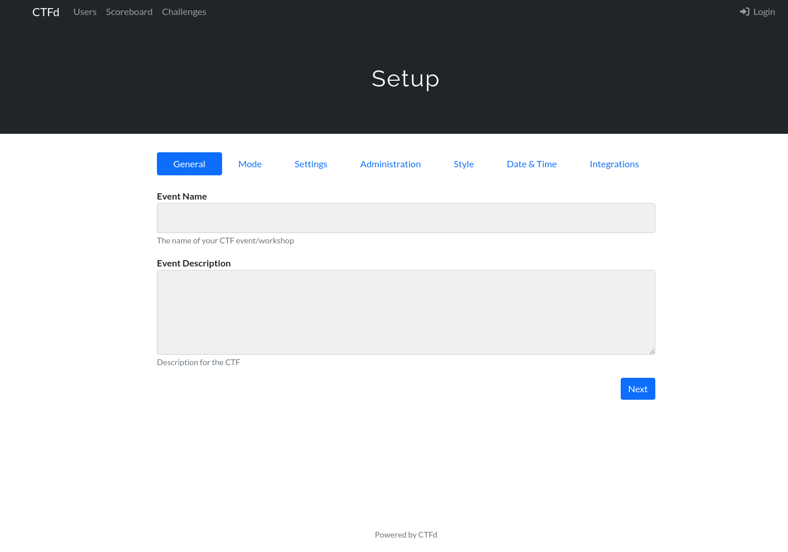

# Documentation of CTF Building
##  Introduction 

You might be here, reading this documentation because you thought to build a CTF 

Well, I had the same thought , as a CTF player. I always wanted to host a CTF event and I got a chance to host one in my college for the upcoming IT department event .

So I was super excited to build it , But there was a problem . There was no step by step guide for it . So I decided to document my first CTF building so that it will be help for people like me in the future who are getting to the building of CTF and here you are reading the documentation and I hope i will be good foundation for you to get started.

okay let's get started but wait **where do i start from here ???**

## prerequisite knowledge

### What is a CTF ??
> Capture The Flag is more of competitive online game/challenges where people play as a team or individuals to solve challenges to get  flags ( special text usually in format ) and when the flag is submitted to the website , The team gets points based on the difficulty level of the challenges . 

>There are two types of CTF : 
>1. Jeopardy CTFs ( Most common )
>2. Attack & Defense CTFs

>To get started with your CTF you can start with [Pico CTF](https://picoctf.com/)

### Docker  
> Docker is an open-source platform that enables developers  to build  , deploy  , run, update  and manage application easily.
> To learn more visit [Docker Documentation](https://docs.docker.com/guides/docker-overview/)
> 
### Linux 
> Linux is a family of open-source Operating System similar to UNIX 
>  I am using Kali Linux for building the CTF 

##  Getting Started

### A Foundation 

The CTF requires a platform to have login,registration , team formation, verifying the user , scoreboard calculation and more and more and more ....

Building these from scratch is a not great way to build your first CTF  because our motive is not to build a platform to build all of these rather to build a CTF . So What to do ??

There is a CTF framework to do all the necessary things needed for our CTF
> That is CTFd .  For more info [Github link](https://github.com/CTFd/CTFd)

So let's lay over foundation

So i used the CTFd docker image to span a CTFd container 
```bash 
docker run -p 8000:8000 -it ctfd/ctfd
```

This will setup everything to need that's all.

If you have good knowledge in docker then so know that we are publishing/binding the port 8000 of both our local machine and CTFd container. Now go visit this link [localhost:8000 ](http://localhost:8000 ) 

When you visit this link for the first time after running the docker container you will be redirected to setup page 


You can fill up your event name in General , Admin username, email and password in  Administration. and click finish in Integrations. Don't worry about other you can change the config later during the building.

Guess what we build for foundation.
## Adding Challenges 

### Types 

1. Welcome 
2. OSINT
3. Web
4. Cryptography 
5. Stenography
6. Reverse Engineering 
7. Forensics
8. Binary Exploitation and more 

### Let's  create a Welcome flag 

1. Click on the ***Admin Panel***
3. Click on the  ***Challenges***
	
1. Click on the ***Plus icon*** and enter your information for challenge
	 - Ohhh, we need a CTF flag right ??
	 - Let's have format : flag{Unique_Content}
	 - example flag : flag{W3CloME_F14G}
	 
	 > To generate a flag for your CTF use this website [Sukka Lab](https://lab.skk.moe/ctf-flag-generator)
		 
	
4. Click ***Create*** and fill in flag we just created and click ***Finish*** 
	

We just created our first  CTF challenge 


So I hope  you got the fundamentals of CTF building, feel free to play around the CTFd framework and familiarize yourself with